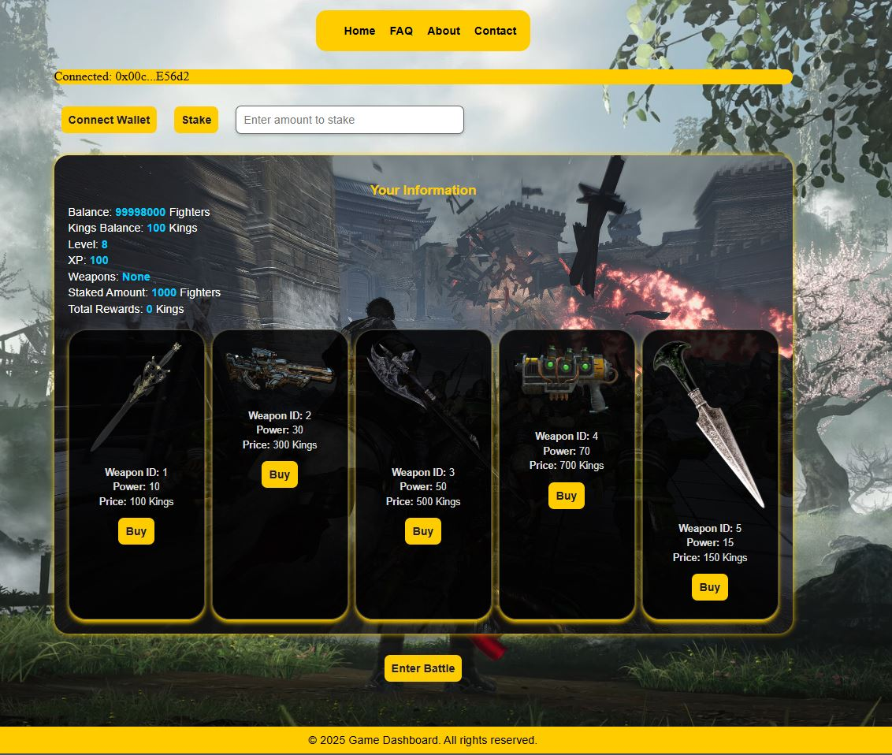

# Kings Web3 Game



## 🎮 Overview

**Kings Web3 Game** is a blockchain-based game that integrates staking, rewards, and battles into a fun and interactive gameplay experience. Players stake their **Coinzax tokens**, earn **Kings tokens**, level up, and participate in challenges and battles.

---

## 🛠 Features

- **Staking System**: Stake **Coinzax tokens** to earn **Kings tokens** and rewards.
- **Leveling Up**: Gain XP to level up and unlock better rewards.
- **Weapons System**: Purchase weapons to enhance your power in battles.
- **Battle Mode**: Compete with other players to earn rewards and improve your stats.
- **Tax Distribution**: Periodic tax rewards for eligible players.

---

## 🚀 How to Run the Project

Follow these steps to set up and run the project:

### 1. Clone the Repository
```bash
git clone https://github.com/ramykatour/Kings-web3-game.git
```

### 2. Navigate to the Project Directory
```bash
cd Kings-web3-game
```

### 3. Install Dependencies
```bash
npm install
```

### 4. Start the Development Server
```bash
npm run dev
```

---

## 📂 Project Structure

The project is organized as follows:

```
Kings-web3-game/
├── public/
│   └── kings.png
├── src/
│   ├── components/
│   │   ├── Staking.js
│   │   ├── Battle.js
│   │   └── Weapons.js
│   ├── styles/
│   │   └── styles.css
│   ├── app.js
│   └── config.js
├── index.html
├── README.md
└── package.json
```

---

## 📚 FAQ

For frequently asked questions, check the [FAQ section](./faq.md).

---

## 📄 License

This project is licensed under the [MIT License](./LICENSE).

---

## 🤝 Contribution

Contributions are welcome! Please fork the repo, create a branch, and submit a pull request.

---

## 📞 Contact

For support or questions, feel free to reach out to [Ramy Katour](https://github.com/ramykatour).
